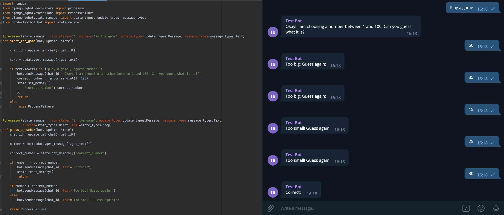

# Django Telegram Bots

This package can be used to have [Telegram Bots](https://core.telegram.org/bots) in your Django project.
 It is designed in a way allowing you to have multiple number of bots in the same project.

Telegram Bot API version: 4.6 

 
## Setup
1. Install package from pip:  
   
        pip install django-tgbot
    

2. Add `django_tgbot` to your Django project's `INSTALLED_APPS`

 

## Definitions
It is important to understand these definitions in order to read the rest of the doc or to use the package.

##### Client
Anything that can send messages or updates to the bot is called a **client**. This can be a user, another bot or a channel.
Users can send messages to the bot in private chats or groups, bots can send messages in groups and channels can send messages in
channels (of which our bot is a member). So when we talk about a **client** we are talking about one of these three.

##### Telegram State

A client can be working with the bot in different settings. For example, a user can send messages to the bot in a private chat or in a group
 or different groups. A bot can send messages visible to our bot in different groups. These should be handled separately. If a user is working
 with the bot in 2 groups at the same time, we do not want their interactions with the bot in one group to interfere with their interactions
 with the bot in the other group or in the private chat. Here comes the **Telegram State**.

**Telegram State** holds information about a client, the chat in which they are using the bot and some other auxiliary data
for helping the bot to handle updates. These data are stored in the database under the model `TelegramState`. Please read its full documentation
from [here](models/telegram_state.md).

##### Processor
Whenever an update is received from Telegram, a `Telegram State` object will be assigned to it. One will be created if there is not any for this
particular client and chat. Now we have a bot, an update to process and a state holding information about the client. It is time to process all of these
information. A **processor** is a function that takes these 3 object (namely the bot, the update and the state) and processes it. Processors can respond
to an update in whatever way they want. They can modify the state, they can send a message to this client or they can do nothing. Please read full documentation
of **processors** from [here](processors.md).

<b>Let's have a look at how to [Create a new bot with django-tgbot](createtgbot.md) next.</b>